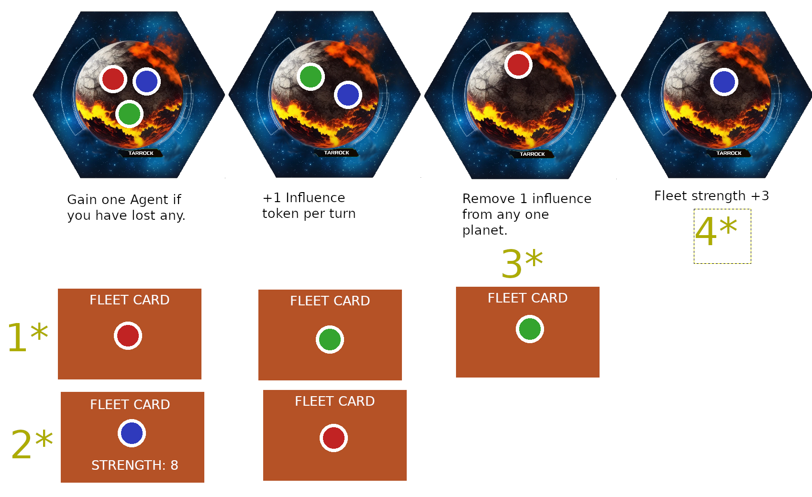

## OVERVIEW
1. This is an expansion of the game Coup, where Stored Influence replaces money. Agents are the hidden cards with special abilities
1. The last surviving player wins.
1. Players are eliminated when they have no Planetary Influence on any planet OR they would lose an Agent but have none left.
1. Planets have special abilities that are gained upon capture. Planets are captured when only one player has Planetary influence on it.
1. Players use fleets to remove influence on planets.
1. Special Benefit cards exist on planets and in players hands. If a player is the sole

## CARDS & TERMS
* Agents - Similar to Coup ability cards.
* Benefits - One per planet, to be gained for control. And one to each player, to be gained for completing your Secret Objective.
* Secret Objectives - You start the game with one. Upon satisfying the requirements, gain your secret benefit.
* Fleet - Contain a random number in the range [3,9] which decides how many dice you get during liars dice combat.
* Influence - Planetary influence cannot be spent. Only Stored Influence can be.

## SETUP
1. Place planets: count is 4 + 1 for Each player beyond 4
1. Place a random Benefit card, revealed, next to each planet
1. Players start with:
* 2 random Fleets
* 2 random Agents
* a random Secret Objective 
* a random Secret Benefit
* 0 Stored Influence
1. Examine your cards, then players get 4 Planetary Influence to place among planets of their choice going clockwise, placing 1 each turn. Max 1 per planet in this phase.

## COMMON POWERS LIST
1. Move: Deploy, Replace, or Retract a Fleet. When deploying, place it last in line for fleet priority.
1. Construct: Take the top fleet card
1. Enforce: At EACH of your fleet locations, you may choose to Oust Leaders
1. Denounce: Spend 2 Stored influence and pick a player to lose an Agent. A player beginning their turn with 5 or more Stored Influence must do this.

## AGENT POWERS LIST
1. Saboteur: Twice you may: Examine any deployed fleet, may force the owning player to replace it with the top fleet card. Then, you alone may examine it
1. Commander: Take 3 fleets from the fleet deck. Put them on top or bottom in any order, keep one.
1. Assassin:  Destroy one Planetary influence on a planet one of your fleets orbit
1. Decoy: May block assassination and Insurgency if you have a Fleet or Influence on the targetted planet. A player Denouncing you must spend an additional influence
1. Investigator: Pick a player with Agents. Examine a random one of theirs, and draw a new agent from the deck. Choose one for them to keep and one to discard.
1. Insurgents: Spend a Stored Influence and place a Planetary Influence of yours on any planet.

## OUST LEADERS
* Short: Players with fleets vote or abstain to remove Planetary Influence. Disagreements cause combat which is resolved via single elimination Liars Dice. Losers lose Planetary Influence and their fleet.
* Detailed: When a Conflict starts at a planet: the initiating player moves their fleet to the top of the fleet priority list of this planet, shifting the rest downward. Going clockwise, starting with the initiating player, players with fleets may elect any player to lose Planetary Influence. Go clockwise once more to allow players to change their decision, including to abstain or not. Once each player has had 2 chances to vote, resolve the Conflict via Combat.

## COMBAT
* Each player that is not abstaining reveals their fleet strength. They participate in modified rounds of liars dice until the remaining players have no disagreements. Once the conflict is entirely resolved, take all Planetary Influence from eliminated players and the voted player. It is given to the highest priority fleet owner as Stored Influence.
1. The starting player of each round is the one with highest fleet priority
1. A player that would lose a dice is immediately eliminated
1. In reverse clockwise order from the last player, ANY participating player may claim liar or pass. Then the next player may take their turn.

You gain the planet benefit if you are the only one with Planetary Influence on it.

## NOTES:
1. A player beginning their turn with 5 or more Stored Influence MUST Denounce.
1. When a planet is captured, the player with Planetary Influence gains the Benefit. Persistent benefits can be recaptured, while discarded benefits cannot.
1. You can only have one of your fleets on any given planet.
1. The phrase Examine means to secretly read. You cannot show the card to others unless it was already revealed.

## EXAMPLE:
1. The Red player has a fleet card here. Only they know its strength.
1. The Blue player has a fleet of strength 8 here. This is known to everyone, as it is already revealed.
1. Even though Red controls this planet, and has already gained the Benefit, (described below the planet) they can still have their Planetary Influence removed by the Green fleet.
1. Blue controls this planet, but would lose the benefit if their Planetary Influence gets removed from it, since the Benefit is not a one time event.

## SECRET CONDITIONS LIST
1. When the player that starts to your left is eliminated
1. When the player that starts to your right is eliminated
1. When you have 3 or more fleets on the board
1. When you successfully call a bluff on an Agent action
1. When you capture a planet
1. When you have 2 or more Stored Influence
1. When another player is eliminated in Combat you are participating in

## BENEFITS LIST
1. Persistent: Gain a Stored Influence at the beginning of each of your turns
1. Persistent: Gain 2 dice when participating in any Conflict
1. Persistent: Gain 3 dice when participating in any Conflict
1. Immediately discard this, then rearrange the fleets on up to two planets
1. Immediately discard this, then draw 2 fleet cards
1. Immediately discard this, then pick any deployed fleet and discard it
1. Immediately discard this, then take one Planetary Influence from any planet
1. Immediately discard this, then gain 1 Agent if you have lost any
1. Immediately discard this, then place one Planetary influence of any player onto any planet
1. Immediately discard this, then Choose a player to lose an Agent
1. Immediately discard this, then relocate one of any Planetary Influence from one planet to another
1. Immediately discard this, then examine all held cards of another player

## NEW IDEAS
* Events - Inject into the game: Examine X, Influence, agents, planets, etc.
* Prisoner Dilemma game - Trade and gain Influence

## TODO
agent interaction is bad?
run a simulated two player in TTS
find out staples card stock printing
condense to printables
create card backs

## Table Top Simulator Instructions
* Duplicate the Fleet deck x4
* Duplicate the Agents deck x3
* For Influence use Objects > Components > Player Pawns

