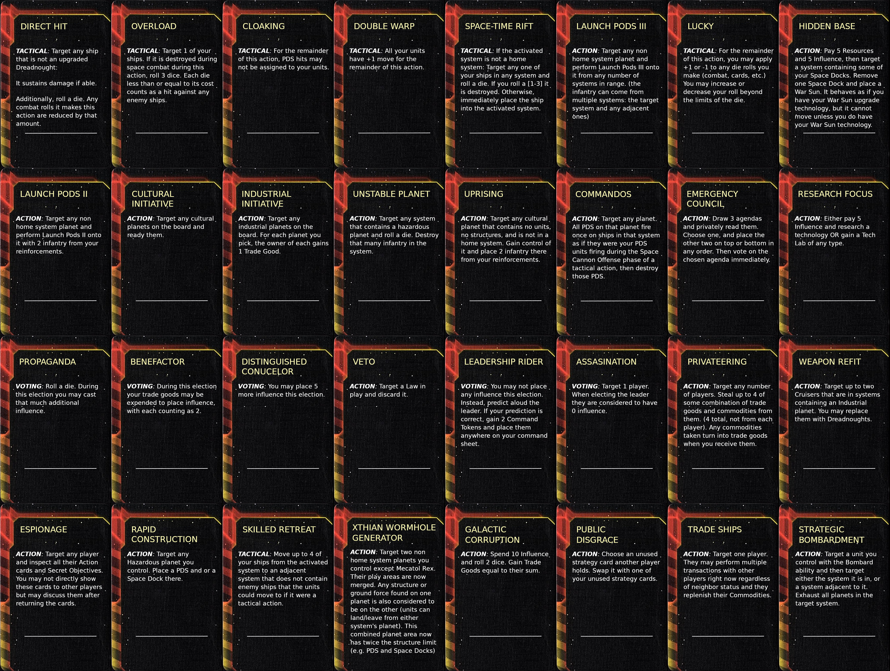
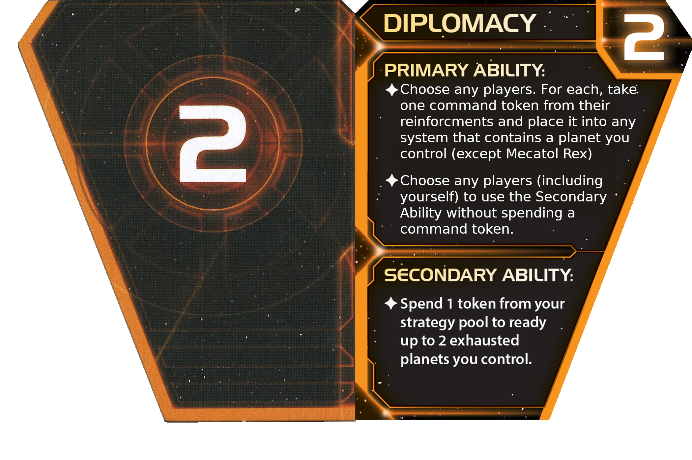
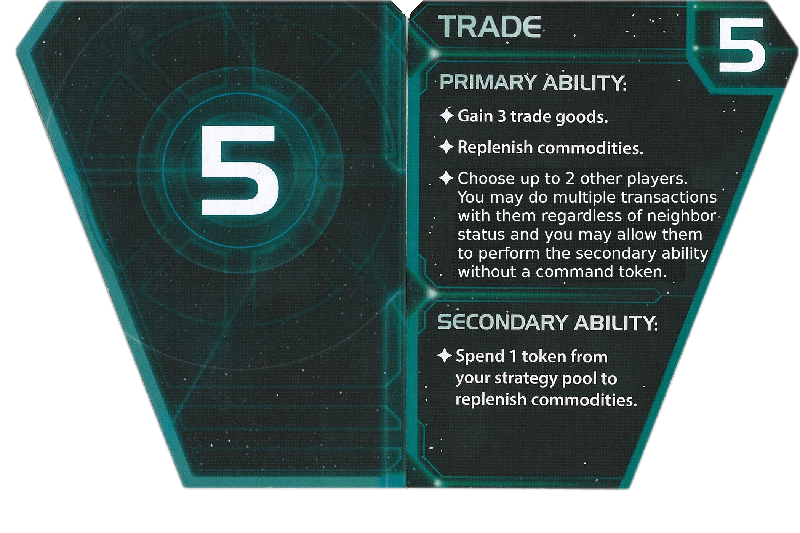
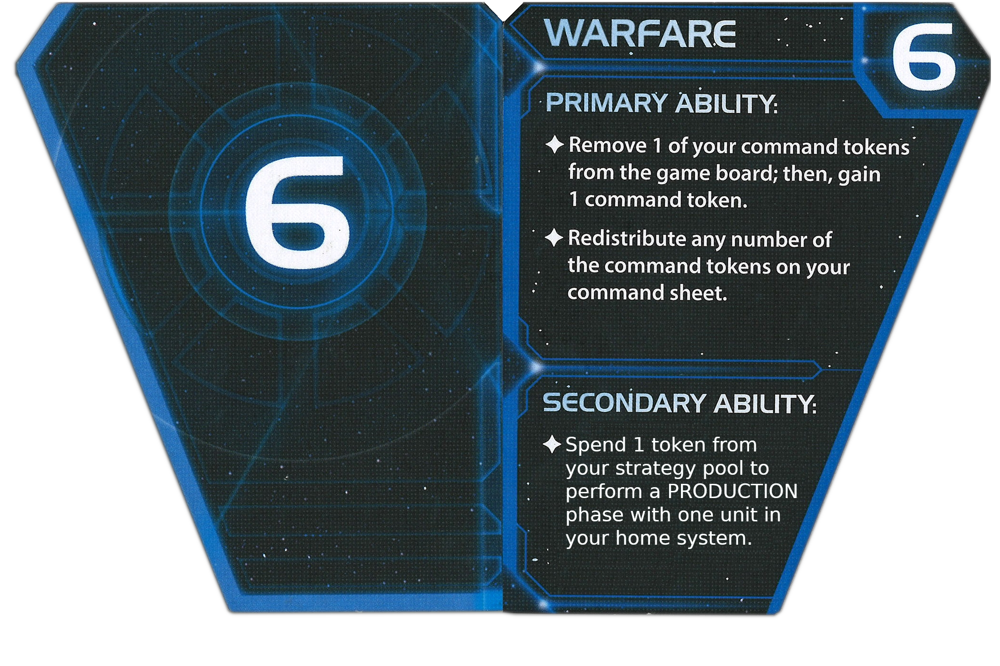
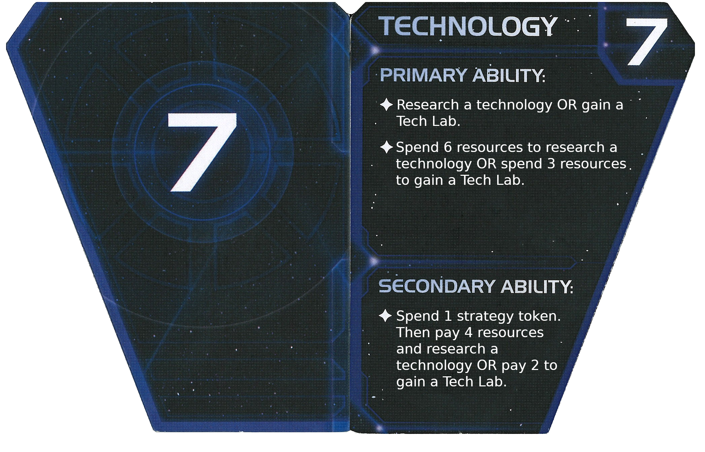

[CLICK THIS TO VIEW ALL CONTENT](#displayed-content)

## TI4 Essence (Work In Progress but playable)
The goals of this overhaul mod are to:
1. Reduce total game time
1. Simplify rules so newer players have an easier time
1. Increase fraction of time spent doing the fun parts (in our opinion)
1. Resolve fundamental faction balancing issues
1. Mostly work with PoK

__NOTES:__ Only `9` Factions have been migrated so far. Not all factions will/should be migrated. So much stuff changed that you'll have to reprint quite a few things or just use Table Top Simulator [TODO Make Workshop Thing](https://www.google.com/).
| # Playtests  | Faction |
| -------- | ------- |
| 1 | Creuss |
| 0 | Naalu |
| 2 | L1Z1X |
| 1 | Nekro |
| 0 | Emirates |
| 1 | Muaat |
| 0 | Sardakk |
| 0 | Arborec |
| 1 | Sol |

## Reasoning

  
Why? - Perceived Issues

What my group sees as issues with TI4:

Issue 1, Turn 1 Disadvantages: Factions have abilities that scale vastly differently depending on the number of players in the game, the board, and what factions you are playing against. I don't want to spend 8 hours being an underdog, especially because my neighbor accidentally picked the perfect counter to me.

Issue 2, Beginner and intermediate players (me and my group) can be overwhelmed by the amount of processing required. A player performs a basic action and now every player needs to look through: 5 action cards, 2 techs of each player, 2 faction abilities, and maybe even heroes in PoK, just to make sure they aren't forgetting something. Lord help you if you want to do any planning while taking into consideration other players stuff!

Issue 3, The game is too long, and not for a good enough reason. Lots of time gets spent on the above, resulting in less time doing the fun parts: planning, executing, negotiating, warring.

Issue 4, I have to hire a lawyer every time someone uses a card / ability in an unexpected manner, which is often.

Issue 5, too much deathball (giant fleet in one spot) and not enough situations that are interesting. It's cool when borders have become mixed up, units are deep in other people's territory, the winner of a battle is a tossup, etc. Big battles are more statistically guaranteed. Small engagements are not. This issue actually exists in tons of war games.

  
How? - High Level Changes to address issues

To speed up the game: Reduce number of spots in the gameplay algorithm where players can interrupt with something, like play an action card. Also start the first round with more units/abilities/stuff to do. This also helps balance some Strategy cards that normally are terrible round 1.

Reduce amount of things each player must keep track of: Redo faction abilities, faction techs, action cards, and heroes as fewer, powerful, exhaustible cards with fewer trigger windows. Now once a player uses it, everyone can stop thinking about it for the round, and it's a lot easier to think about the future. Exhausting also resolves issues with activation scaling: (abilities that trigger everytime X happens, these are impossible to balance around due to issue 1)

Abilities, techs, cards etc. should not outright DISABLE eachother (eg planetary shield vs L1Z1X bombard) They can mitigate them though (see planetary shield redefinition)

Clarify everything and remove [recursive](https://en.wikipedia.org/wiki/Recursion) mechanics (like Action cards targetting other action cards, or triggering other action cards) to avoid strange edge cases where you have to spend time to clarify the rules.

To avoid deathball, or at least mitigate, new cards effects can naturally break these up (Launch Pods especially)

I also read about people's favorite/hated factions and why. I tried to get rid of the bad stuff.

## New Rules and Definitions
1. __New Tech Tree__ - Rule Change - (see cards_tech.png)
1. __New Agendas__ - Rule Change - (see cards_agenda.png)
1. __New Action Cards__ - Rule Change - (see cards_action.png) Max of 4 in a hand. Not automatically gained during the status phase.
1. __Strategy Card Changes__ - Rule Change - (see strat png files)
1. __Faction Setup__ - Rule Change - Factions:
    * __do not__ make use of abilities/effects printed on their _faction sheets_ or _flagship_ or _leaders_; flagships retain any common mechanics like bombard or space cannon; 
    * __do not__ gain starting technologies;
    * __do not__ have access to faction specific technologies;
    * __DO__ have access to their faction specific unit technologies;
    * __DO__ their home system unit setup;
1. __Ability Cards__ - New Card Type - (see cards_abilities.png) Factions no longer have inherent "abilities", instead most stuff related to the faction has been integrated into 4 cards each starts with that may be _exhausted_ during the specified card window (explained later) specified by the card. These can never be removed from a player. Every Ability Card exhausts when used.
1. __Home System Points__ - Rule Change - There are no victory point restrictions if you lose your home system. The first time you lose all planets in your home system you lose 2 VP. You regain them if you take it back. Other players do not gain these 2 VP.
1. __One Agenda__ - Rule Change - Planets are only readied at the beginning of the Strategy phase, not the status or agenda phase. First, players go clockwise starting with the speaker, they may first play up to one VOTING card and then allocate their planet Influence among any players including themselves. After each player has done this, the player with the most Influence becomes the Leader and draws one Agenda and decides its outcome. Influence ties are resolved randomly.
1. __Planetary Shield__ - Rule Change - Each planetary shield may negate 2 bombardment HITS during each TACTICAL action.
1. __Order Definition__ - If the order of play is ever unspecified, it is: Clockwise with Speaker Last
1. __Card Window__ - New Term - A spot in the game algorithm where a player may activate abilities of the correct card window type. Card windows are never nested/recursive/inside eachother. If a player is resolving a TACTICAL window card, it is not possible for another player to play a card during this time.
1. __ACTION__ - Card Window - Indicates the ability can be used via a Component Action just like a normal ACTION action card. This matches standard TI4.
1. __STATUS__ - Card Window - Indicates the ability can be used at the beginning of the status phase in clockwise order, speaker last.
1. __VOTING__ - Card Window - Indicates the ability can be used just before you would place votes for an agenda (usually during the agenda phase). Up to two abilities per player only. You may not play a card or ability until it is your turn to vote (even if you cannot place votes).
1. __TACTICAL__ - Card Window - Indicates the ability can be used during the a TACTICAL action card window. After activating a system, the player taking the tactical action may use up to two Tactical cards (Tactical Ability Card, Tactical action card, etc.), _then_ moves any units. Now each player that has units or owned planets in the activated system (go clockwise from activating player) may use up to two Tactical cards. Afterward, the tactical action continues normally, starting with Space Cannon Offense.
1. __FLAGSHIP TACTICAL__ - Card Window - Indicates the ability can be used during the TACTICAL card window if the player's Flagship is in a system (aka not dead). FLAGSHIP ACTION is like an ACTION card but requires your Flagship for any effects.
1. __Stall__ - Clarification - Any unexhausted _Ability Card_ of type ACTION or FLAGSHIP ACTION can instead be exhausted to skip your turn, and the text on the ability is ignored, as if you discarded an action card. You can use a FLAGSHIP ACTION ability this way regardless of whether you have a Flagship.
1. __Ground Force Location Specifics__ - Rule Change - Ground forces automatically and immediately land on allied planets if they end up in a system containing allied planets. Players must specify which planet which forces are on if multiple are available. For example: any ground forces not committed to a ground invasion, where a planet is successfully captured, must then land after the ground combat resolves. Placing ground forces into a system via non-tactical action events also follows this rule: if any ground force finds itself in a system with allied planets, they must be placed on a particular planet. Ground forces can only sit in the space area if there are no friendly planets to land on.
1. __Capacity Specifics__ - Rule Change - The TI4 rules for capacity, move, and invasion are unclear, even examining online guides. So... units can be loaded onto ships with Capacity that start, pass through, or end in the active system. They may only be unloaded onto planets during the Invasion phase in the activated system.
1. Launch Pods N__ - New Mechanic - Similar to the Sardakk Commander ability but WITHOUT requiring a tactical activation token. Upon activating this ability immediately send N Infantry from a target source of Infantry to a planet in this system or adjacent systems. Perform an Invasion phase immediately. If you have multiple Launch Pod abilities that can trigger at the same time they can invade together. (there is tech to help counter this ability) This is not a Tactical action and there is no Card Window during this Invasion phase (just like the standard Invasion phase in TI4 Essence).
1. __Tech Lab__ - New Mechanic - Planet technology specialties are now called Tech Labs. Some things award Tech Labs which must be immediately placed on a planet controlled by that player. The planet must be in a system that contains no other Tech Labs on any of its planets. These may not be removed and are treated the same as traditional planet technology specialties. If a player gains a token and is unable to place it immediately, it is destroyed. Effects from exploration cards do not have these placement restrictions.
1. __Transactions__ Rule Change - You can trade action cards, and owned agenda cards, in a transaction unless something says otherwise. A single transaction can now be multistep (eg. assets flow from player A to B to A to B....) Multistep transactions are fully binding.

## Move / Capacity / Invasion Clarifications 

  
Details

It's so dumb I have to write this. The official move / capacity rules are a mess and people online aren't even sure! I have redefined them here to match what the developers mostly intended. I did intentionally deviate slightly from fleet pool considerations. In essence we make a distinction between units that are currently held in a space area VS units carried by a unit that is moving (called Cargo). Some definitions:

* Carried - Unit types that may be transported, like infantry and fighters, but not a Cruiser. A unit like fighter II may choose whether it is classified as carried or not during a specific step. A unit with a non 0 capacity can never be classified as carried.

* Containers - Units with non 0 Capacity value, such as War Suns and Carriers.

* Cargo - Units that are held in a specific unit during the move phase. If a unit is removed from play while it has Cargo inside of it, all Cargo is immediately removed as well. Only Carried units can be turned into Cargo.

* Space Area - A generic location in a system where carried units may be as long as there is capacity. Carried units are not assigned to any particular unit with capacity while here and are not "Cargo".

* Capacity N - This unit can hold that many Carried units during the Move phase, aka Cargo. Also used to calculate space area capacity.

* Load Cargo - Step - You may put some number of carried units in the system into the specified unit with enough remaining Cargo slots. These units are "in the Container unit", not in the space area. Units with non 0 capacity cannot be loaded as cargo. These units become Cargo.

* Commit - Step - You may take ground forces from the space area and place them on any planets in the same system, whether to invade or not.

* Check Capacity - Step - sum the Capacity of units in a system to calculate your space area capacity for that system. Choose carried units to destroy until you are less than or equal to it.

* Check Fleet - Step - if you have units that may decide to be carried or not, they must decide now. If they decide no but are cargo, they are no longer cargo and move to the space area as ships. Now choose ships to destroy until your ship count in a system is less than or equal to your fleet pool capacity. 

* Space Dock - Its fighter support ability can be read as Capacity that only fighters may use/fill.

## Move Phase Changes:

__a1.__  Before moving units, publicly elect every unit that will be moving to the active system. Each must have enough move to make it to the activated system. You do not need enough fleet pool to sustain them at the destionation.
> Elect beforehand since units are logically moving together under a time constraint. You aren't allowed to wait and see if each ship reaches the destination before sending the next one.

> Now let Containers pick up cargo to put in the active system:

__a2.__  Now pick a single unit from among them, then move it one system at a time while performing the following:
__a3.__  Before it moves _from_ each system: You may `Load Cargo` into it (unless the system has a command token of yours) 

__a4.__  Once all units have finished moving `Check Fleet`
> Unload Cargo after fleet check to avoid tons of carriers injecting their Cargo into the system if that many Container ships wouldn't be allowed due to fleet pool

__a5.__  Then unload Cargo into the space area: there can no longer be any cargo, all those units are now in the space area themselves.
> It's possible existing carried + arriving cargo now exceeds capacity, so check capacity:

__a6.__  `Check Capacity`

## Invasion Phase Changes:

> Now let's allow free exchange of carried units between containers and planets:

__b1.__  First you may take each carried unit in the system and either move it TO the space area from another area, or FROM the space area to another area, such as planets you control. So you cannot move units from one planet to another here.

__b2.__  Then `Check Capacity`
> make sure the player cannot move more ground forces locally than their capacity should allow

Then you may `Commit`.
Then resolve all ground combat 

__c1.__  At the end of the Invasion phase any ground forces in the space area must land on friendly planets if able (and they must specify the planet). No ground forces may remain in the space area unless they have nowhere to land.
> This resolves awkward mechanics where players should hold some or most of their ground forces in space based on meta knowledge of card events

## Results
1. It's clear you can shuffle ground forces in the activated system like you'd expect.
1. You can move a fighter II into a system that does not contain enough fleet pool, but can hold the fighter via capacity.
1. You still cannot effectively move a carrier into a system that doesn't have enough fleet pool for it but does have enough capacity for its cargo. The cargo wouldn't make it.
1. Since you move units one at a time it is possible to "overload" the destination fleet pool for the sake of something like a gravity rift. Eg max 5 but you sent 7, first 2 made it, next 1 died, next 3 made it, and then you elected to remove the 1 excess ship which may or may not contain cargo.
1. A space dock can facilitate moving ground forces since it can free up capacity providing for fighters during b1 that could then be used for ground forces 

## Fast Start
During the first action phase, BEFORE any player takes an action, do the following. SWTSGC = "Starting with the Speaker, going clockwise," (or simultaneous if nobody cares about others decisions)
1. SWTSGC Each player may immediately research a tech they have the prerequisites for (probably no prerequisites)
1. SWTSGC Each player gains an additional 2 command tokens to place on their command sheet
1. SWTSGC Each player picks a system adjacent to where their home system would normally be (not the same as home system for Creuss and similar!) and places 6 Resources worth of their units there. Perform a tactical action (do not place an activation token) in this system starting with Space Combat (skipping activation and movement)

## Todo Prioritized
1. examine Discordant Stars mod for interesting ideas
1. Make resource and influence collection/tracking easier somehow
1. put into TTS workshop
1. put strat card textures into correct format for scripted TTS version (Twilight Imperium IV)
1. create battle cards that randomly spice up a battle? (you draw one during a battle and it has some impact)
1. consider giving each faction 1 or 2 special unit techs
1. review promissory notes
1. review exploration cards
1. review legendary planet abilities
1. review relics
1. More interesting anomalies such as the _Advanced Anomalies_ mod.
1. [Great Structures and New Strategy Cards](https://www.reddit.com/r/twilightimperium/comments/19eh3zp/homebrew_ti4_strategy_cards_and_great_structures/)

## Design Reminders
1. Make sure each faction has the same amount of Stall ability (unless intentional)
1. Avoid recursive card windows
1. Rolling dice is fun (cards, effect, etc.)

## How to print stuff cheap (in gray and white)
1. Gimp:
1. Colors > Saturation > 0
1. Colors > Invert
1. Colors > Curves

## Displayed Content:
Less laws (things you have to be remembering)

New abilities and the average strength of each card is larger (you don't get any without the Politics strat card! no free status phase action cards)

Faction abilities

Less techs, but they are better (you have to get prerequisites to get to final layer)

Buff all around

Buff early and late game

Balance for player count

Redefine secondary

Factor in tech labs and get less techs

Buff early game

